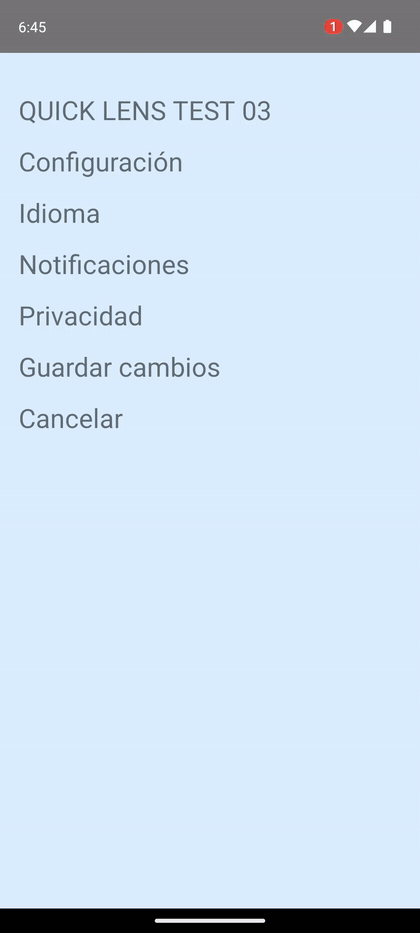
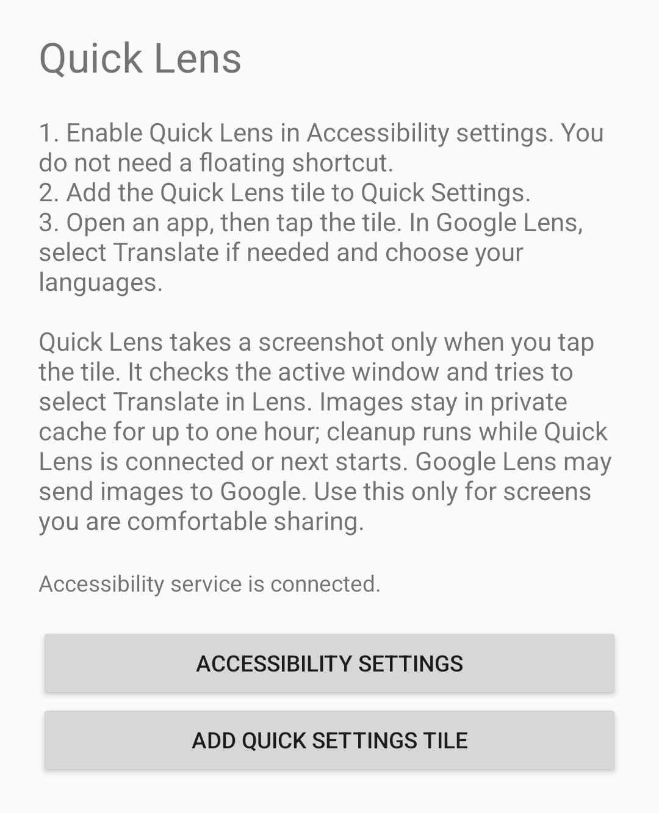

# Quick Lens

[](https://github.com/abocha/quick-lens/actions/workflows/build.yml)

[](LICENSE)

**Translate what's on your screen, straight from Android Quick Settings.**

Quick Lens captures the app you're viewing, opens the image in Google Lens, and tries to switch to **Translate** automatically.

No floating button. No copying text. No screenshots piling up in your gallery.

**[Download the latest APK](https://github.com/abocha/quick-lens/releases/latest)**

## See it in action

<p align="center">
  
</p>

<p align="center"><sub>Quick Settings → Quick Lens → Google Lens Translate · Recorded on an Android emulator</sub></p>

<details>
<summary>View the setup screen</summary>

<p align="center">
  
</p>

</details>

## How it works

**Open an app** → **Tap Quick Lens in Quick Settings** → **Read the translation in Google Lens**

Quick Lens closes the notification shade and captures the previous app window, not its own setup screen. Google Lens displays the translated image. If automatic Translate selection doesn't work, you can select **Translate** manually in Lens.

Quick Lens is a shortcut to Google Lens, **not** a translation engine or an in-place translation overlay.

## Get started

**Requirements:** Android 14+ (API 34+) and the Google app with a working Google Lens image handler.

1. Download the signed APK from [Releases](https://github.com/abocha/quick-lens/releases) and install it. A SHA-256 checksum is provided with each release.
2. Open **Quick Lens → Accessibility settings** and enable its Accessibility service.
3. Tap **Add Quick Settings tile**, or add **Quick Lens** from the Quick Settings edit menu.
4. Open any ordinary app, expand Quick Settings, and tap the **Quick Lens** tile.
5. Choose your languages in Google Lens the first time you use it.

> **Accessibility permission:** Android may block enabling Accessibility for sideloaded apps. If you trust the APK, open Android's app info for Quick Lens and look for **Allow restricted settings**, then return to Accessibility settings. The separate floating Accessibility shortcut is **not** needed.

### If something doesn't work

- **Tile doesn't appear:** add it manually from Quick Settings → Edit.
- **Service is disconnected:** reopen Quick Lens and check Accessibility settings. After a force stop, Android may require you to reopen the app.
- **Lens opens in the wrong mode:** tap **Translate** manually. Automatic selection depends on Google's current interface.
- **Nothing gets captured:** try an ordinary, unprotected app window. Quick Lens intentionally refuses uncertain or protected captures.

## Privacy, by design

Quick Lens uses Android platform APIs and has **no internet permission, analytics, account, ads, or runtime libraries**. It doesn't continuously monitor the screen.

- A screenshot is taken **only after you tap the tile**.
- Each screenshot is stored temporarily in private app cache, never in your gallery.
- The Google app gets temporary read access to the individual image. Images expire for sharing after **one hour** and are cleaned up periodically or when the app starts again.
- Quick Lens does not log or upload screen text itself.

**Important:** Google Lens may process or upload the screenshot using Google's services. Avoid using Quick Lens on screens you would not want to share with Google. Enabling an Android Accessibility service grants broad access; review the [source code](app/src/main/java/local/quicklens/) if this matters to you.

## Compatibility and limitations

- **Tested:** Pixel 7 Android 14 emulator (Google Play image), and POCO X5 5G on Android 14 / HyperOS, including operation after reboot.
- **Not supported:** Android 13 or earlier, protected (`FLAG_SECURE`) windows, and bypassing app screenshot restrictions.
- **Not fully tested:** split-screen layouts, secondary displays, and other manufacturers' Android variants.
- **Google Lens integration is best-effort.** Its image-sharing entry point and Translate controls are not stable public APIs and can change with Google app updates.
- Quick Lens cancels captures if it cannot reliably identify the intended window. Requests have a deadline, and repeated taps do not queue additional captures.

<details>
<summary><strong>Build and test from source</strong></summary>

Requires **JDK 17 or 21**, Android SDK Platform **34**, and Build Tools **34.0.0**. Set `JAVA_HOME` and `ANDROID_HOME` (or use an untracked `local.properties`). Android Studio is optional.

```sh
./gradlew clean testDebugUnitTest lintDebug assembleDebug assembleRelease
```

On Windows, run `gradlew.bat` instead. The debug APK is in `app/build/outputs/apk/debug/`. **Release APKs are unsigned unless you configure your own signing key.** Official downloadable releases are signed separately; signing credentials are not included in the repository or GitHub Actions.

CI builds, runs the JVM tests, and checks Android Lint. The tests cover capture-request lifecycle, window-change protection, image naming, URI validation, and cache cleanup.

For emulator-only smoke checks, see [`tools/`](tools/). The scripts use a separate synthetic test app; it is **not** packaged in the release APK.

### Signing a local release

Create an ignored `.private/signing.properties` file:

```properties
storeFile=.private/release.jks
storePassword=YOUR_PRIVATE_PASSWORD
keyAlias=quicklens
keyPassword=YOUR_PRIVATE_PASSWORD
```

Back up your release keystore and passwords securely: losing them prevents compatible updates signed with that key. Never commit signing credentials. Verify the resulting APK with `apksigner verify --print-certs`.

</details>

## License

[MIT](LICENSE). Built with Android platform APIs and no bundled third-party application code. The Gradle Wrapper retains its own [Apache 2.0 license](gradle/wrapper/LICENSE).
